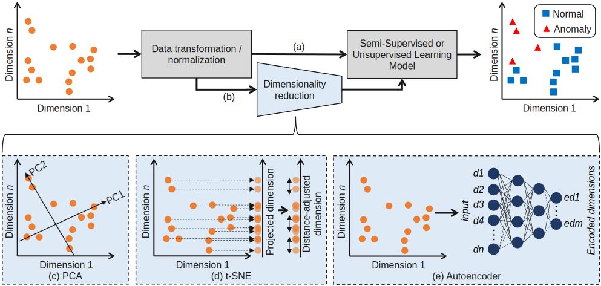

# Optical Network Security Management: Requirements, Architecture and Efficient Machine Learning Models for Detection of Evolving Threats

Authors: [Marija Furdek](https://www.chalmers.se/en/staff/Pages/Marija-Furdek-Prekratic.aspx)\*, [Carlos Natalino](https://www.chalmers.se/en/staff/Pages/Carlos-Natalino-Da-Silva.aspx)\*, Andrea Di Giglio\*\*, and Marco Schiano\*\*

\* Department of Electrical Engineering, Chalmers University of Technology, Gothenburg, Sweden (e-mail: furdek@chalmers.se, carlos.natalino@chalmers.se).

\*\* Telecom Italia, Turin, Italy (e-mail: andrea.digiglio@telecomitalia.it, marco.schiano@telecomitalia.it).

Paper available at https://doi.org/10.1364/JOCN.402884

**Abstract:** As the communication infrastructure that sustains critical societal services, optical networks need to function in a secure and agile way. Thus, cognitive and automated security management functionalities are needed, fueled by the proliferating Machine Learning (ML) techniques and compatible with common network control entities and procedures. Automated management of optical network security requires advancements both in terms of performance and efficiency of ML approaches for security diagnostics, as well as novel management architectures and functionalities. This paper tackles these challenges by proposing a novel functional block called Security Operation Center (SOC), describing its architecture, specifying key requirements on the supported functionalities and providing guidelines on its integration with optical layer controller. Moreover, to boost efficiency of ML-based security diagnostic techniques when processing high-dimensional optical performance monitoring data in the presence of previously unseen physical-layer attacks, we combine unsupervised and semi-supervised learning techniques with three different dimensionality reduction methods and analyze the resulting performance and trade-offs between ML accuracy and run time complexity.

This work builds upon the testbed and dataset published previous and available [here](https://raw.githubusercontent.com/carlosnatalino/JLT-2020-ML-Practical-Perspective/).

## What is in this repository?

- The plotting of results presented in the paper can be found [here](./plotting.ipynb).
- The implementation and training of several neural network architectures to perform the task of autoencoder [here](./training-autoencoder.ipynb). In the paper, only one of the structures is explained.
- The implementation and testing of DBSCAN and OCSVM algorithms over the full dataset for attack detection is available [here](./training-detection-raw-dataset.ipynb).
- The implementation and testing of DBSCAN and OCSVM over encoded dataset using PCA is available [here](./training-detection-pca.ipynb).
- The implementation and testing of DBSCAN and OCSVM over encoded dataset using t-SNE is available [here](./training-detection-tsne.ipynb).
- The implementation and testing of DBSCAN and OCSVM over encoded dataset using autoencoder is available [here](./training-detection-ae.ipynb).
- The scalability test performed can be found [here](./scalability-test.ipynb).

### Libraries required

The implementaion uses TensorFlow 2.x, pandas, scikit-learn and matplotlib.

## Citing the work

Bibtex entry:

~~~~
@ARTICLE{FurdekEtAl:JOCN:2020,
  author={M. {Furdek} and C. {Natalino} and A. D. {Giglio} and M. {Schiano}},
  journal={Journal of Optical Communications and Networking}, 
  title={Optical Network Security Management: Requirements, Architecture and Efficient Machine Learning Models for Detection of Evolving Threats}, 
  year={2020},
  doi={https://doi.org/10.1364/JOCN.402884},
  url={https://github.com/carlosnatalino/2020-JOCN-efficient-ML},
}
~~~~

Contact:

Carlos Natalino, carlos.natalino@chalmers.se, [Twitter](https://twitter.com/NatalinoCarlos), [ResearchGate](https://www.researchgate.net/profile/Carlos_Natalino).